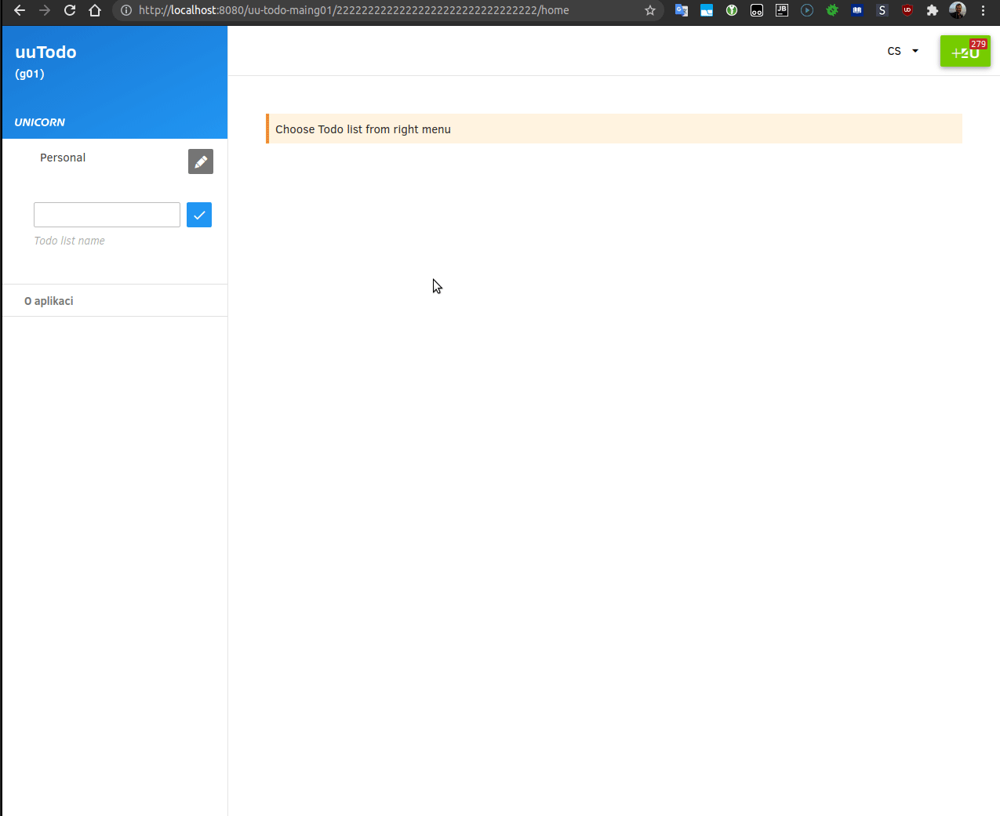
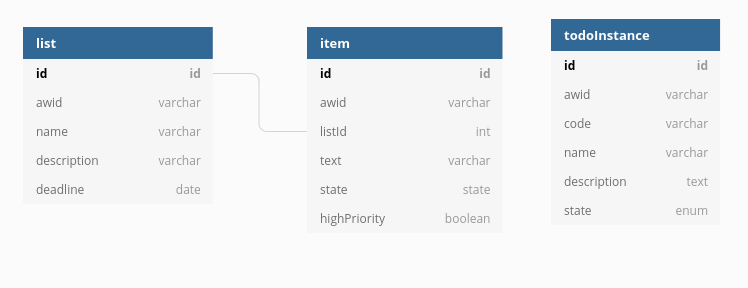

# uuTodo

Zadání [frontend](https://uuapp.plus4u.net/uu-bookkit-maing01/78462435-bbbfbad5d130488e85ccad7d34b61a22/book/page?code=67586767) 
& [backend](https://uuapp.plus4u.net/uu-bookkit-maing01/bbbfbad5d130488e85ccad7d34b61a22/book/page?code=uuToDo_uuSubApp) 



### Schema



TodoInstance object:
```js
const todoInstanceSchema = {
  id: "012...", //generated unique code
  awid: "012...", //app instance id - unique code specified externally
  sys: {
    cTs: "...", //create timestamp
    mTs: "...", //modification timestamp
    rev: 0 //revision number
  },
  code: "...", //unique code of the todoInstance
  name: "...", //name of the todoInstance
  description : "...", //description of the todoInstance
  state: "..." //state of the todoInstance - one of active, suspended, closed
};
```

List object:
```js
const listSchema = {
  id: "012...", //generated unique code
  awid: "012...", //app instance id - unique code specified externally
  sys: {
    cTs: "...", //create timestamp
    mTs: "...", //modification timestamp
    rev: 0 //revision number
  },
  name: "...", //name of the list
  description : "...", //description of the list
  deadline: "2021-03-15" //date when all items on the list are supossed to be done
};
```

Item object: 
```js
const itemSchema = {
  id: "012...", //generated unique code
  awid: "012...", //app instance id - unique code specified externally
  sys: {
    cTs: "...", //create timestamp
    mTs: "...", //modification timestamp
    rev: 0 //revision number
  },
  listId: "...", //id of the list in which the item belongs to
  text: "...", //text of the item
  state: "...", //state of item, one of active, completed, cancelled 
  highPriority: false //mark if it is high priority item
};
```

### API

**todoInstance**
- [x] **POST** - sys/uuAppWorkspace/init - Initializes application during installation.
- [x] **GET** - sys/uuAppWorkspace/load - Loads the application configuration for logged user.
- [x] **POST** - todoInstance/update - Updates application basic information.
- [x] **POST** - todoInstance/setState - Sets application state. Two options are possible: active or suspended.


**list**
 
- [x] **POST** - list/create - Creates a new (empty) list.
- [x] **GET** -list/get - Returns uuObject list.
- [x] **POST** - list/update - Updates uuObject list.
- [x] **POST** - list/delete - Deletes the given list.
- [x] **GET** -list/list - Returns a list of all todo lists.

**item**

- [x] **POST** - list/create - Creates a new item in the list.
- [x] **GET** -list/get - Returns uuObject item
- [x] **POST** - list/update - Updates uuObject item
- [x] **POST** - list/setFinalState - Item state can be changed from active state to cancelled or completed state.
- [x] **POST** - list/delete - Deletes the item. Only active or cancelled items can be deleted.
- [x] **GET** -list/list - Returns a list of items by given criteria

### GUI
- [x] View lists
- [x] Add a list
- [x] Delete a list
- [x] Delete a list - confirm modal
- [x] Edit a list
- [x] View tasks
- [x] Add a task
- [x] Delete a task
- [x] Edit a task
- [x] Change task state
- [x] Filter tasks
- [ ] Styling


TODO:
- [x] backend tests
- [x] mock data
- [ ] deadline do GUI listu - nedělat
- [x] add lsi

## Development and Usage

See following guidelines:

- [uuAppg01Devkit Documentation](https://uuapp.plus4u.net/uu-bookkit-maing01/e884539c8511447a977c7ff070e7f2cf/book)
- [uuSubApp Instance Descriptor](https://uuapp.plus4u.net/uu-bookkit-maing01/289fcd2e11d34f3e9b2184bedb236ded/book/page?code=uuSubAppInstanceDescriptor)
- [uuApp Server Project (NodeJs)](https://uuapp.plus4u.net/uu-bookkit-maing01/2590bf997d264d959b9d6a88ee1d0ff5/book/page?code=getStarted)
- [uuApp Client Project (UU5)](https://uuapp.plus4u.net/uu-bookkit-maing01/ed11ec379073476db0aa295ad6c00178/book/page?code=getStartedHooks)
